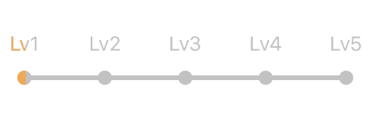

# HorizontalProgress



Simple horizontal progress bar with animation
## What

Use it you can make a horizontal progress bar with tip textlabel easily.

## Features

* Animation support
* Interface customization

## CocoaPods
To use ImageCenterButton add the following to your Podfile

    pod 'HorizontalProgress'

## Usage
```objective-c
//Color of progress unachieved
@property(nonatomic, copy) UIColor *unachievedColor;
//Color of progress achieved
@property(nonatomic, copy) UIColor *achievedColor;
//Maximum progress point radius
@property CGFloat pointMaxRadius;
//Maximum progress line height
@property NSUInteger lineMaxHeight;
//Current progress level
@property NSInteger currentLevel;
//Current progress animation duration
@property CFTimeInterval animationDuration;
//Tip label position relative to progress line
@property ProgressLevelTextPosition textPosition;

//Array contained strings of progress tip label
//NSString elements only
@property(nonatomic, copy) NSArray *progressLevelArray;

//Progress fill animation start
- (void)startAnimation;
```
 
## License

HorizontalProgress is available under the MIT license. See the LICENSE file for more info.

---
README(Chinese)
==========

## HorizontalProgress 是什么

可以用它很方便的生成横向带节点的进度条。

## HorizontalProgress提供了哪些功能

 * 支持Fill动画
 * UI可定制

## HorizontalProgress 使用配置
```objective-c
//未达标的填充颜色
@property(nonatomic, copy) UIColor *unachievedColor;
//已达标的填充颜色
@property(nonatomic, copy) UIColor *achievedColor;
//节点的最大半径
@property CGFloat pointMaxRadius;
//线条的最大高度
@property NSUInteger lineMaxHeight;
//当前的达标等级
@property NSInteger currentLevel;
//动画的执行时长
@property CFTimeInterval animationDuration;
//节点提示标签相对于线条的显示位置
@property ProgressLevelTextPosition textPosition;

//标签文本NSString类型数组
@property(nonatomic, copy) NSArray *progressLevelArray;

//填充动画触发方法
- (void)startAnimation;
```

## CocoaPods 支持

你可以在 Podfile 中加入下面一行代码来使用HorizontalProgress

    pod 'HorizontalProgress'

## 协议

HorizontalProgress 被许可在 MIT 协议下使用。查阅 LICENSE 文件来获得更多信息。
